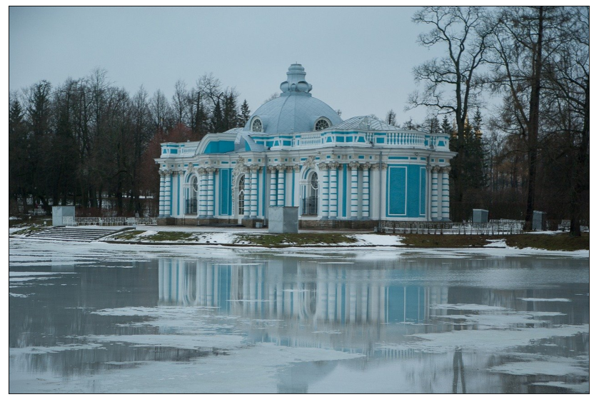
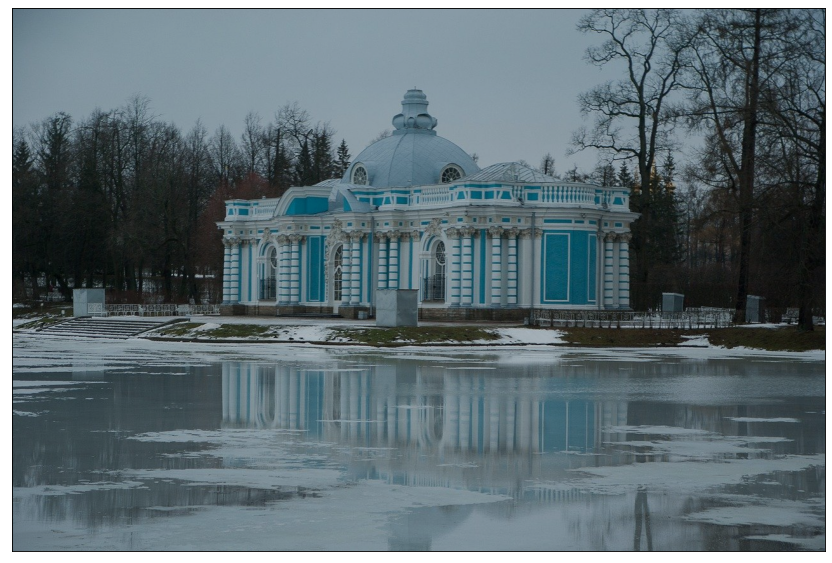
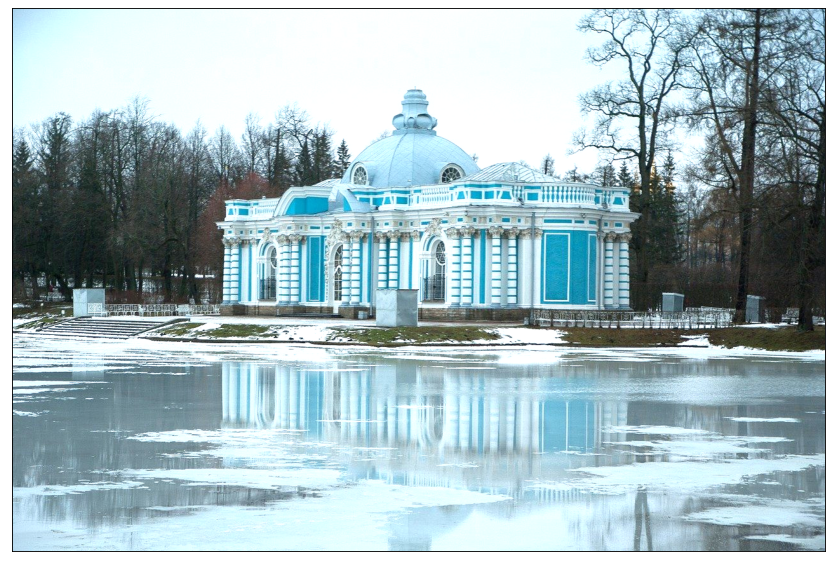
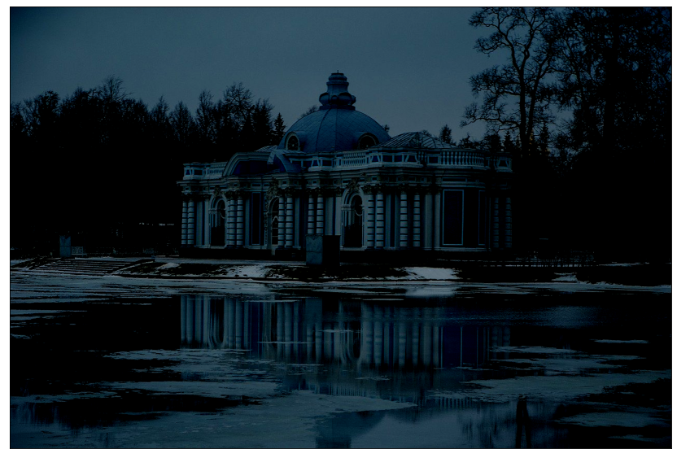
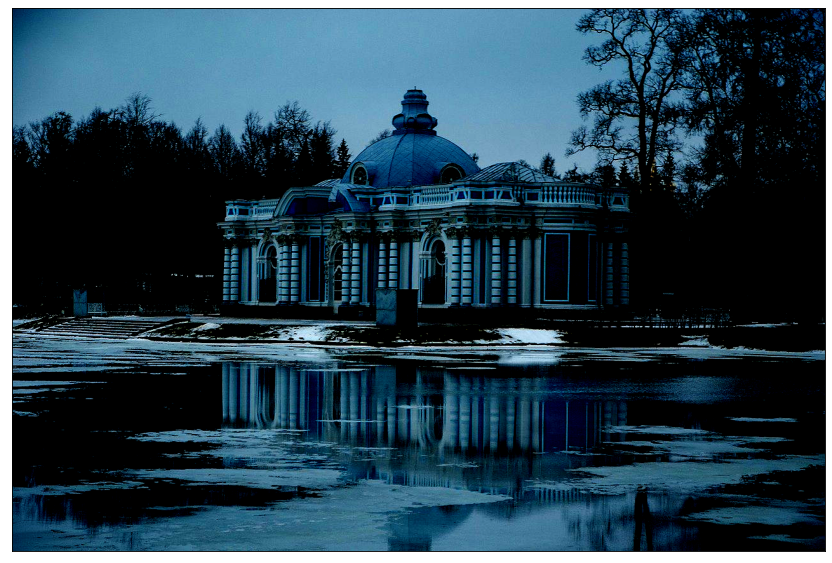

**Буду использовать GPU ускорение.**


```python
import cv2
import numpy as np
import cupy as cp
from matplotlib import pyplot as plt
from matplotlib.pyplot import figure

use_graph = True
```

1. С помощью библиотеки OpenCV считайте изображение:


```python
image = cp.array(cv2.imread("data/russia-1927758_1280.jpg"), dtype=cp.uint8)

print(image.shape)
```

    (856, 1280, 3)
    


```python
# Изобразить его можно с помощью matplotlib
if use_graph:
    figure(figsize=(16, 9), dpi=80)
    plt.imshow(cv2.cvtColor(image.get(), cv2.COLOR_BGR2RGB))
    plt.xticks([]),plt.yticks([])
    plt.show()
    
```


    

    


2. Определите параметры изображения.


```python
print(f"Ширина изображения в пикселях : {image.shape[1]}")
print(f"Высота изображения в пикселях : {image.shape[0]}")
print(f"Среднее значение интенсивности пикселя изображения : {cp.mean(image)}")
```

    Ширина изображения в пикселях : 1280
    Высота изображения в пикселях : 856
    Среднее значение интенсивности пикселя изображения : 121.34244974201714
    

Выполню преобразование яркостей каждого канала из целочисленного диспазона от 0 до 255 во float32 диапазон от 0 до 1. 

Также OpenCV умеет работать только с float32, но не float64, float128 и так далее.


```python
image_float = (image / 255.0).astype(cp.float32)
```

3. Выполните преобразование экспозиции.


```python
for p in [-0.3, 0.6]:
    image_exposed = image_float * cp.power(2.0, p).astype(cp.float32)
    image_exposed = np.clip(image_exposed, 0.0, 1.0)
    image_exposed = cp.round(image_exposed * 255).astype(cp.uint8)
    print(f"Среднее значение интенсивности пикселя преобразованного изображения при p = {p} : {cp.mean(image_exposed)}")
    if use_graph:
        figure(figsize=(16, 9), dpi=80)
        plt.imshow(cv2.cvtColor(image_exposed.get(), cv2.COLOR_BGR2RGB))
        plt.xticks([]),plt.yticks([])
        plt.show()
```

    Среднее значение интенсивности пикселя преобразованного изображения при p = -0.3 : 98.56171966267523
    


    

    


    Среднее значение интенсивности пикселя преобразованного изображения при p = 0.6 : 176.85842247128116
    


    

    


4. Выполните преобразование контрастности.


```python
for p in [-0.3, 0.6]:
    if p > 0.0:
        image_contrasted = ((image_float - 0.5) / (1 - p)).astype(cp.float32)
    else:
        image_contrasted = ((image_float - 0.5) * (1 - p)).astype(cp.float32)
    image_contrasted = np.clip(image_contrasted, 0.0, 1.0)
    image_contrasted = cp.round(image_contrasted * 255).astype(cp.uint8)
    print(f"Среднее значение интенсивности пикселя преобразованного изображения при p = {p} : {cp.mean(image_contrasted)}")
    if use_graph:
        figure(figsize=(16, 9), dpi=80)
        plt.imshow(cv2.cvtColor(image_contrasted.get(), cv2.COLOR_BGR2RGB))
        plt.xticks([]),plt.yticks([])
        plt.show()
```

    Среднее значение интенсивности пикселя преобразованного изображения при p = -0.3 : 26.956039780471183
    


    

    


    Среднее значение интенсивности пикселя преобразованного изображения при p = 0.6 : 51.82651291131231
    


    

    


```python

```
